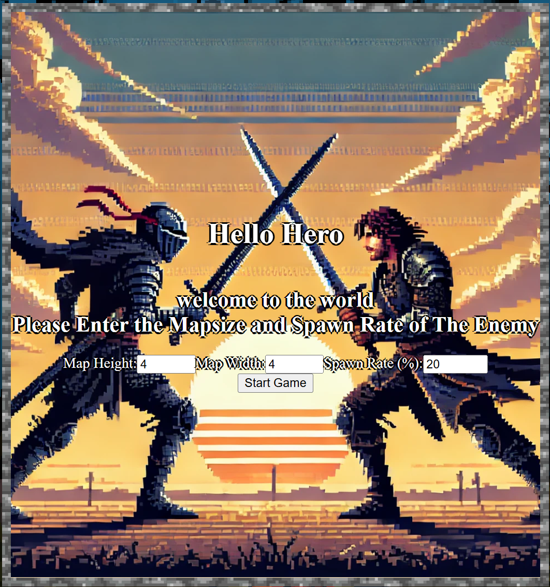

# PROJECT BEAT IT 

Welcome to my first JS game! [HEAD TO THE GAME](https://example.com) 

-Instruction
 -In the starting page you will be asked to enter mapsize and the enemy spawnrate
 

  -Map Height: max amount of tiles in a column for the map
  -Map Width: max amount of tiles in a column for the map
  -SpawnRate: The probability (%) that an enemy will spawn on an empty tile when the game starts.
    The total number of enemies cannot exceed 50% of the total tiles on the map.
    A higher spawn rate means more enemies, but the limit is still half of the map size.
 -click start game when everything is set or you can just go by default

The meter:
random generated target 
index that moves up and down
speed indicator

Scoreboard: 
5 lives for both player and the machine
each miss gets hit from machine 
has to hit machine 5 times 

