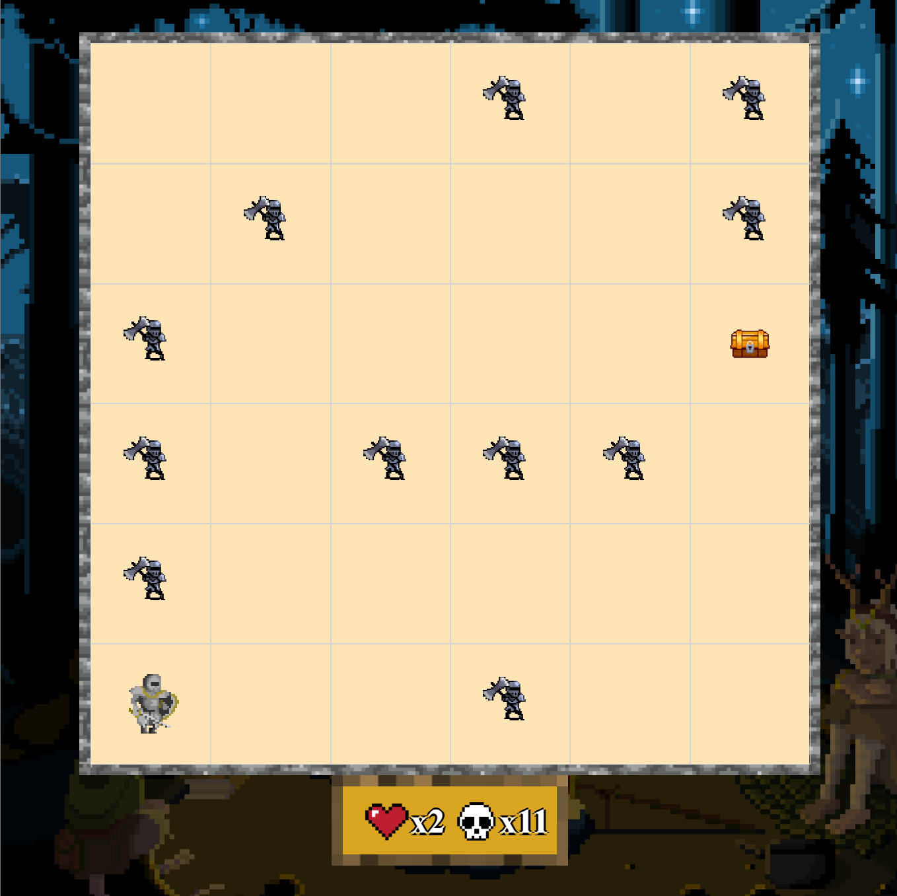
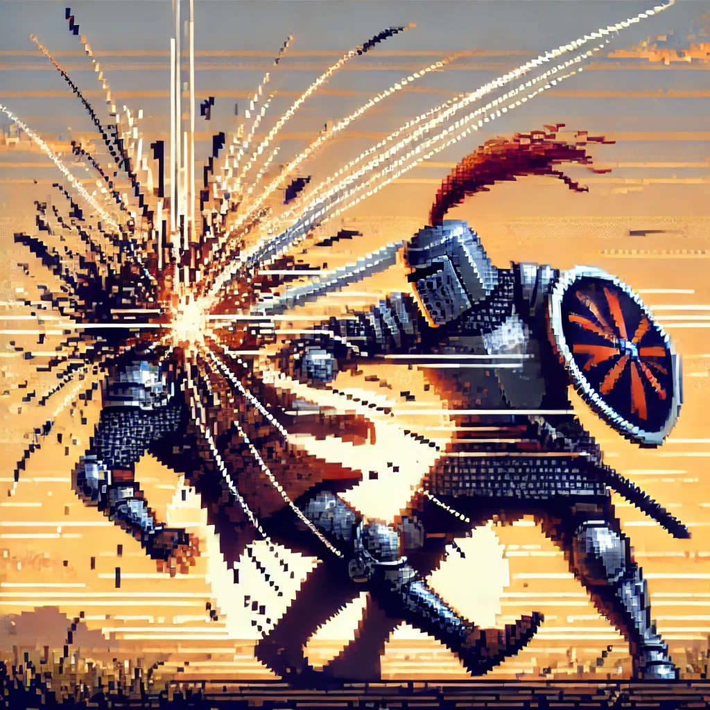
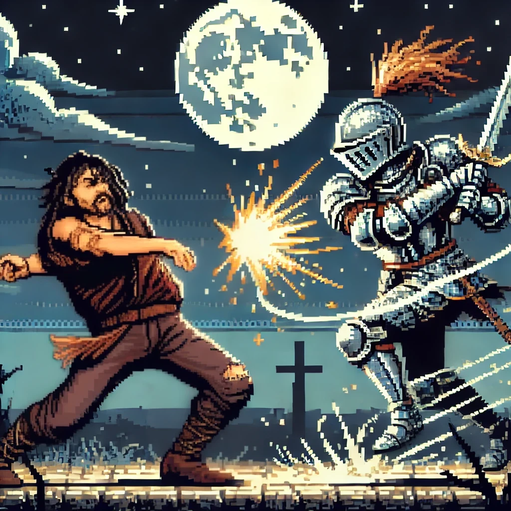
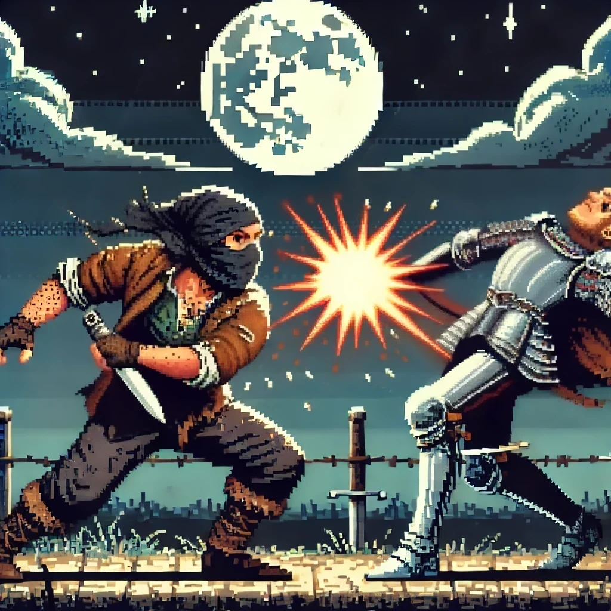
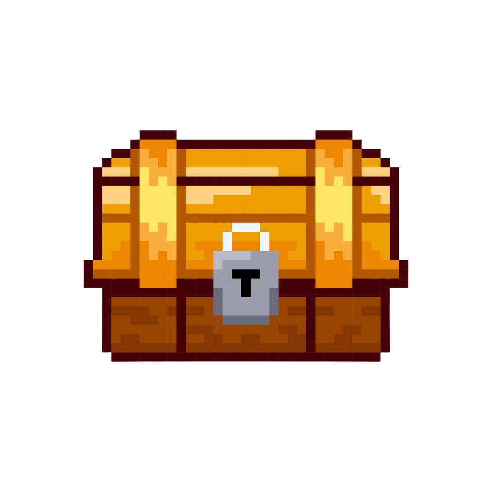
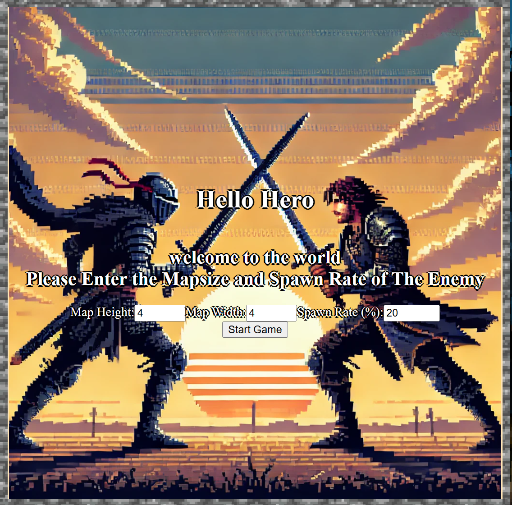
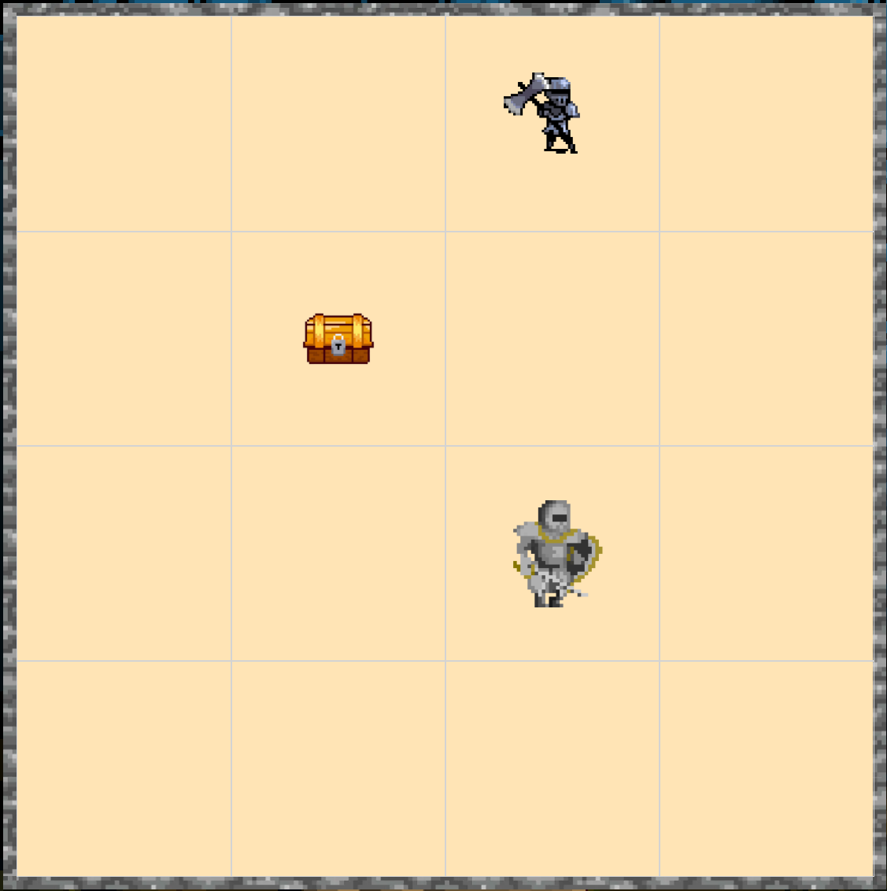
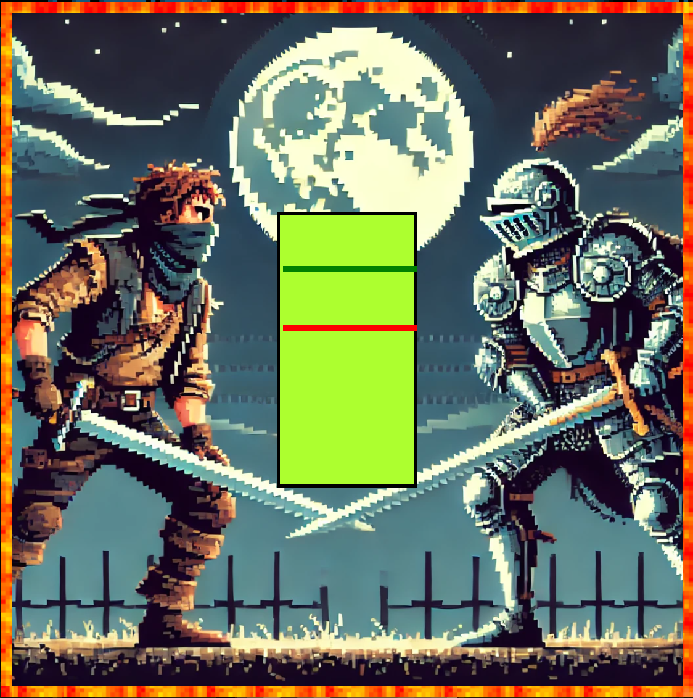

# PROJECT BEAT IT 

Welcome to my first JS game! [HEAD TO THE GAME](https://aoge2716.github.io/First-JS-Game/) 

- Description
    - In the game you will play as a knight going around fighting all the enemies 
    - The goal is to kill all the enemy
          
    - Each enemy and player has the same amount of 2 lives
    - Every time you land a perfect on the enemy you will gain one health
          
    - normal hit will cut one life from the enemy
          
    - miss will cut one life from the player
          
    - getting a chest will give player one extra life
          

- Instruction
    - In the starting page you will be asked to enter mapsize and the enemy spawnrate
          
        - Map Height: max amount of tiles in a column for the map
        - Map Width: max amount of tiles in a column for the map
        - SpawnRate: The probability (%) that an enemy will spawn on an empty tile when the game starts.
            - The total number of enemies cannot exceed 50% of the total tiles on the map.
            - A higher spawn rate means more enemies, but the limit is still half of the map size.
        - Heres an example of a 4x4 map with 20% spawn rate
          
    - Player has to move the arrow key to go around the map.
    - Fighting will be triggered when player walks into a tile with enemy 
          
        - Player have hit the space bar when the red mark is on the green mark
            
## [ENJOY!](https://aoge2716.github.io/First-JS-Game/) 

